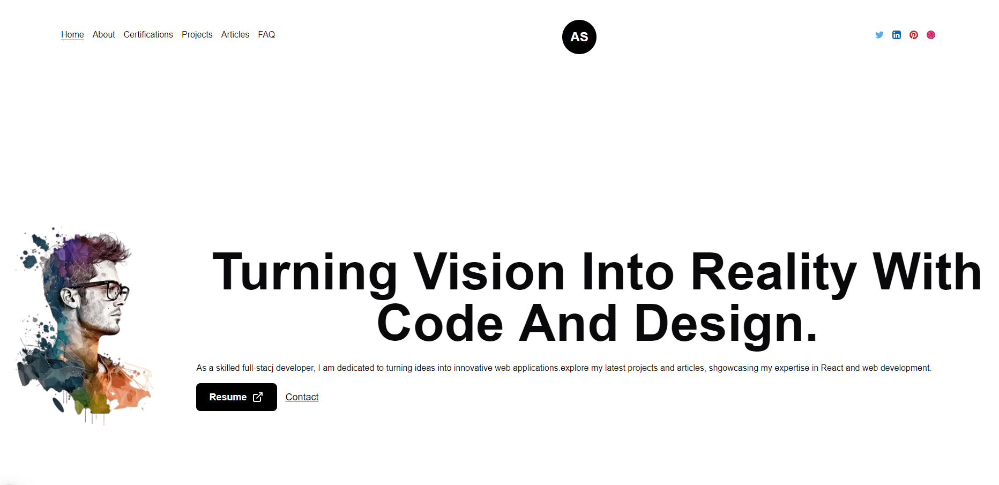

これは[`create-next-app`](https://nextjs.org/docs/app/api-reference/cli/create-next-app)でブートストラップされた[Next.js](https://nextjs.org)プロジェクトです。

[English README](./README.md)

# ポートフォリオウェブサイトリポジトリ



## 技術スタック

[](#)
[](#)
[](#)
[](#)
[](#)
[](#)

### 追加ライブラリ

[](#)
[](#)
[](#)
[](#)
[](#)
[](#)
[](#)
[](#)
[](#)

## 始め方

まず、開発サーバーを実行します：

```bash
npm run dev
# または
yarn dev
# または
pnpm dev
# または
bun dev
```

ブラウザで[http://localhost:3000](http://localhost:3000)を開くと結果が表示されます。

`app/page.tsx`を変更することでページの編集を開始できます。ファイルを編集すると、ページは自動的に更新されます。

このプロジェクトでは、[`next/font`](https://nextjs.org/docs/app/building-your-application/optimizing/fonts)を使用して、Vercelの新しいフォントファミリーである[Geist](https://vercel.com/font)を自動的に最適化して読み込んでいます。

## 機能

- 国際化対応（英語/日本語）
- Tailwind CSSによるレスポンシブデザイン
- ダーク/ライトモード対応
- 検索機能
- モバイルフレンドリーなインターフェース
- ロールベースのアクセス制御

## もっと学ぶ

Next.jsについてもっと学ぶには、以下のリソースをご覧ください：

- [Next.jsドキュメント](https://nextjs.org/docs) - Next.jsの機能とAPIについて学びます。
- [Learn Next.js](https://nextjs.org/learn) - インタラクティブなNext.jsチュートリアルです。

[Next.jsのGitHubリポジトリ](https://github.com/vercel/next.js)もチェックできます - フィードバックや貢献を歓迎します！

## Vercelへのデプロイ

Next.jsアプリをデプロイする最も簡単な方法は、Next.jsの作成者による[Vercelプラットフォーム](https://vercel.com/new?utm_medium=default-template&filter=next.js&utm_source=create-next-app&utm_campaign=create-next-app-readme)を使用することです。

詳細については、[Next.jsデプロイメントドキュメント](https://nextjs.org/docs/app/building-your-application/deploying)をご覧ください。
